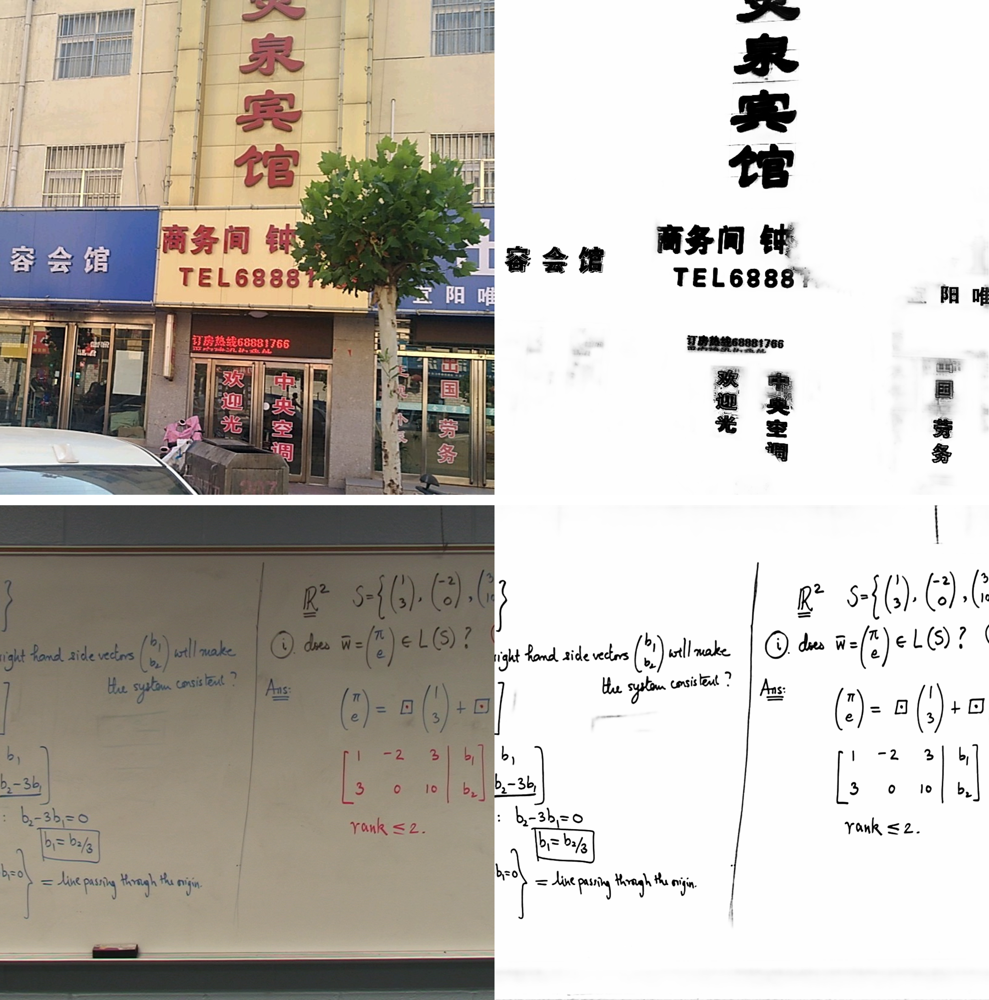
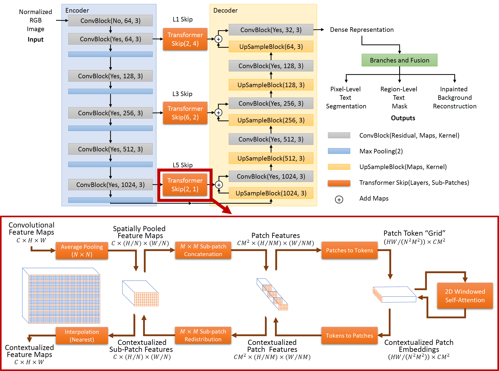
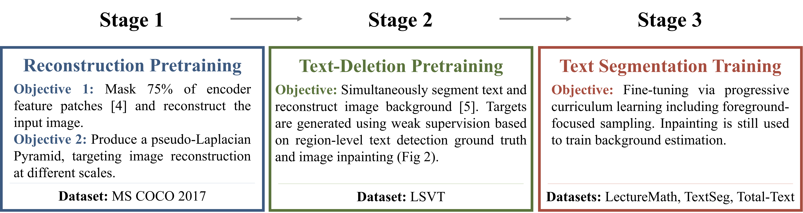

# Lect-Former: Localized Self-Attention Skip Connections for Whiteboard Content Extraction (DAS 2026)
Code and tools used for the paper: **["Lect-Former: Localized Self-Attention Skip Connections for Whiteboard Content Extraction" (DAS 2026)](https://link.springer.com/chapter/10.1007/978-3-032-36207-0_16)**

**Lect-Former** is a model for extracting handwritten content from lecture videos at the pixel level, producing clean foreground masks for downstream lecture-video analysis. 

Building on our previous work, **[FCN-LectureNet](https://ieeexplore.ieee.org/document/9494351)**, Lect-Former improves pixel-level foreground extraction as an upstream component for lecture-video summarization, indexing, and retrieval.

<p align="center">
  
</p>

<p align="center">
  <em>Examples of Lect-Former binarization predictions. Left: input images. Right: extracted foreground content.</em>
</p>

## Dataset
The LectureMath Ext (2026) Dataset can be downloaded from here: [LectureMath Ext (2026) Dataset](https://www.dropbox.com/scl/fi/6srviqnl5iuumzew88fqr/LectureMath_Ext_bin_annotations.zip?rlkey=82yxh4u8npstbixhyr4n6l8m0&dl=0)

## Weights
Pretrained and trained model weights for **Lect-Former** and **FCN-LectureNet baseline** can be found [here](https://www.dropbox.com/scl/fo/fx1k614nz0rbn0s1t4nsb/AJsdTiV1jaqQqbf_HnTv870?rlkey=8demvn6anx51xlu574lkr817d&dl=0).

- `*_PRETRAINED_Stage1.dat`: Complete model weights after Stage 1 reconstruction pretraining.
- `*.encoder.dat`, `*.decoder.dat`, `*.skips.dat`: Individually saved Stage 1 component weights for component-wise model initialization.
(`*.skips.dat` applies to Lect-Former.)
- `*_PRETRAINED_Stage2.dat`: Complete model weights after Stage 2 text-deletion pretraining.
- `*_TRAINED_Stage3.dat`: Final model weights after LectureMath fine-tuning, used for inference and evaluation.

> [!NOTE]
> UPDATE (09/09/2026): 
>  - Code used for training is now available.
>  - Code used for evaluation is partially available.
>  - Additional evaluation scripts, pretrained/trained weights and missing evaluation data will be made available soon.

# ▸ Key Features & Methodology

<p align="center">
  
</p>

- **Localized Self-Attention Skip Connections:** Lect-Former follows a U-Net-style encoder-decoder architecture and replaces selected skip connections with localized self-attention modules to incorporate spatial context efficiently.

- **Three-Branch Prediction:** The network uses one main branch for pixel-level text segmentation and two auxiliary branches for region-level text detection and text-free background estimation, providing additional guidance for foreground extraction.

<p align="center">
  
</p>

- **Three-Stage Training Protocol:** The progressive training strategy helps the model learn text-aware representations before fine-tuning on the target lecture-video domain, where only limited handwritten lecture data is available.


# ▸ Results & Metrics
Final evaluation on the extended **LectureMath dataset** uses standard document-image binarization metrics from **[H-DIBCO](https://vc.ee.duth.gr/h-dibco2016/benchmark/?utm_source)**:

These metrics evaluate both pixel-level foreground accuracy and the structural quality of the binarized handwritten-content output.

| Model | PSNR ↑ | DRD ↓ | F1 ↑ | Pseudo F1 ↑ |
|---|---:|---:|---:|---:|
| FCN-LectureNet | 21.84 | 9.11 | 82.94 | 84.37 |
| **Lect-Former** | **22.96** | **6.69** | **85.91** | **87.84** |

> Additional ablation studies on pretraining objectives, localized self-attention implementations, and auxiliary-branch fusion strategies are reported in the paper. 

# ▸ Usage Guide

## Installation

1. Clone the repository:

    ```bash
    git clone https://github.com/kdavila/LectFormer_DAS2026.git
    cd LectFormer_DAS2026
    ```

2. Create and activate a virtual environment.

    Python 3.9 or later is recommended.

    ```bash
    python -m venv .venv
    ```

    - **Windows:**

        ```bash
        .venv\Scripts\activate
        ```

    - **Linux/macOS:**

        ```bash
        source .venv/bin/activate
        ```

3. Install PyTorch.

    The following configuration was used and tested for this project:

    ```bash
    pip install torch==2.6.0 torchvision==0.21.0 --index-url https://download.pytorch.org/whl/cu126
    ```

    For other CUDA configurations, install the compatible PyTorch version using the official PyTorch installation instructions.

4. Install the remaining dependencies.

    ```bash
    pip install -r requirements.txt
    ```

> [!NOTE]
> A CUDA-capable NVIDIA GPU is strongly recommended for training and evaluation.

## Dataset Preparation

[MS-COCO 2017](https://cocodataset.org/#download), [LSVT](https://rrc.cvc.uab.es/?ch=16&com=downloads), [LectureMath Ext](#dataset), [TextSeg](https://github.com/SHI-Labs/Rethinking-Text-Segmentation), [Total-Text](https://github.com/cs-chan/Total-Text-Dataset)
(LSVT registration required, TextSeg requires an email request)

Download the required datasets and place them in the corresponding folders under `data/`. See the `info.txt` file in each folder for details.

### Ground-Truth Mask Preparation
```bash
cd lectformer2026
```

1. LSVT
    
    Generate binary text masks from the LSVT annotations.

    ```bash
    python prep_LSVT_00_prepare_binary_text_masks.py <LSVT_label> <image_folder> <mask_folder>
    ```
    
    Split the images and masks into training and validation sets.
    
    ```bash
    python prep_LSVT_01_split_binary_text_masks.py <image_folder> <mask_folder> <validation_ratio> <train_image_folder> <train_mask_folder> <valid_image_folder> <valid_mask_folder>
    ```

2. TextSeg

    Convert the TextSeg semantic labels into binary text masks.

    ```bash
    python prep_TextSeg_01_from_semantic_to_bin.py <semantic_label_folder> <binary_label_folder>
    ```
    
    Split the images and binary masks using the official TextSeg split file.
    
    ```bash
    python prep_TextSeg_02_split.py <image_folder> <binary_label_folder> <split_json> <output_folder>
    ```
    
3. TOTALTEXT

    Generate binary text masks from the Total-Text annotations.

    ```bash
    python prep_TOTALTEXT_01_ds_ninja_gen_text_masks.py <totaltext_root_folder>
    ```
    
    Split the training set into training and validation subsets.
    
    ```bash
    python prep_TOTALTEXT_02_split_valid.py <totaltext_train_folder>
    ```

### Expected Data Structure
```
data/
│
├── COCO2017/
│   ├── train/
│   ├── valid/
│   └── debug/
│
├── ICDAR2019_LSVT/
│   ├── sub_train_images/
│   ├── sub_train_masks/
│   ├── sub_valid_images/
│   ├── sub_valid_masks/
│   └── debug_images/
│
├── lecturemath_v2/
│   ├── videos/
│   ├── debug_images/
│   └── db_LectureMath.xml
│
├── TextSeg/
│   └── splits/
│       ├── train/
│       │   ├── img/
│       │   └── masks/
│       │
│       ├── val/
│       │   ├── img/
│       │   └── masks/
│       │
│       └── debug_images/
│
└── total-text/
    ├── train_sub_train/
    │   ├── img/
    │   └── masks/
    │
    ├── train_sub_valid/
    │   ├── img/
    │   └── masks/
    │
    └── debug_images/
```

## Training

Lect-Former is trained progressively through three stages:

### Stage 1

Pretrains the Lect-Former autoencoder on MS-COCO 2017 for general image reconstruction.

```bash
python train_00_pretrain_AE_reconstruction.py <config>
```

### Stage 2

Loads the Stage 1 weights and jointly trains the text-detection, background-estimation, and binarization branches using LSVT.

```bash
python train_01_pretrain_text_detector.py <config>
```

### Stage 3

Loads the pretrained model and fine-tunes the complete network on LectureMath Ext.

```bash
python train_02_train_binarizer.py <config>
```

> Additional training scripts for the baseline models and ablation experiments are provided in the same directory.

## Evaluation

Evaluate the final model produced by each configuration on the LectureMath Ext test set:

```bash
python eval_keyframe_bin.py <config> <model> <dataset_name>
```
The reported results use the H-DIBCO document image binarization metrics: PSNR, DRD, standard Recall/Precision/F1, and pseudo Recall/Precision/F1.

The reported results are averaged over five independently trained models.

# ▸ Configuration
The `configs/` folder contains JSON configuration files for **Lect-Former** and the **FCN-LectureNet baseline** experiments.

The main configuration sections are:
- **`General`**: Device and output directory settings.
- **`Network`**: Model architecture, prediction heads, localized self-attention skip connections, normalization, and activation settings.
- **`Evaluation`**: Output settings for saved evaluation predictions.
- **`Training`**: Stage 3 LectureMath fine-tuning, including data augmentation, optimization, sampling, checkpoints, and pretrained model paths.
- **`Ablation`**: Dataset, training, and evaluation settings used for TextSeg/Total-Text ablation experiments.
- **`Pretraining`**: Stage 1 reconstruction and Stage 2 text-deletion pretraining settings.

Before running the scripts, update the **device**, **dataset paths**, **output paths**, and **pretrained model paths** according to your local environment. 

> [!TIP]
> For reproducibility, the training crop size is set to **256 x 256**. In our experiments, larger crop sizes improved performance, but also increased GPU memory usage and training time.


# ▸ Citation

If you find this code or dataset work useful, please cite our paper:

```bibtex
@inproceedings{davila2026lect,
  title={Lect-Former: Localized Self-attention Skip Connections for Whiteboard Content Extraction},
  author={Davila, Kenny and Xu, Fei and Ro, Sunyoung and Song, Min},
  booktitle={International Workshop on Document Analysis Systems},
  pages={263--281},
  year={2026},
  organization={Springer}
}
```
